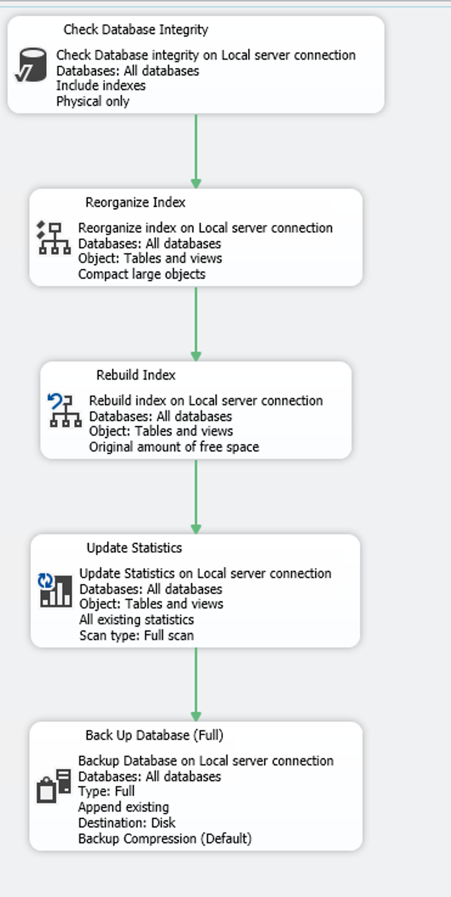

# MaintenanceQueries-SQL-Server

**Enterprise-level SQL Server Maintenance Solution** using Ola Hallengren procedures with automated jobs, monitoring, and alerting.



## 📋 Overview

This repository provides a complete maintenance solution for SQL Server databases, featuring:

- **Automated database maintenance** using proven Ola Hallengren procedures
- **Comprehensive backup strategy** (Full, Differential, Transaction Log)
- **Performance optimization** through index maintenance and statistics updates
- **Proactive monitoring** with email alerting
- **Emergency recovery** procedures for critical situations

## 🏗️ Repository Structure

```
MaintenanceQueries-SQL-Server/
├── jobs/                                   # Automated maintenance jobs
│   ├── AlertingSetup.sql                   # Email configuration
│   ├── DatabasesBackups.sql                # Full backups - Daily 8 PM
│   ├── DifferentialBackups.sql             # Differential backups - Every 6 hours
│   ├── IntegrityCheck.sql                  # Database integrity - Daily 5 AM
│   ├── LogsCleanUp.sql                     # Log cleanup - Monthly
│   ├── MonitoringChecks.sql                # Health monitoring - Every 2 hours
│   ├── OptimizeIndexes.sql                 # Index optimization - Daily 6 AM
│   ├── SystemMaintenance.sql               # System cleanup - Weekly Sundays
│   └── TransactionLogBackups.sql           # Log backups - Every 30 min
├── queries/                                # Utility queries
│   ├── database_info.sql                   # Database file information
│   ├── emergency_database_recovery.sql     # Emergency recovery procedures
│   └── testquerie.sql                      # Test queries
├── MaintenanceSolution.sql                 # Ola Hallengren main script
├── images/                                 # Documentation assets
├── LICENSE
└── README.md
```

## 🚀 Quick Start

### Prerequisites

- SQL Server 2008 R2 or later
- `admin` privileges
- SMTP server access
- Backup directory

### Installation Steps

1. **Clone the repository:**
   ```bash
   git clone https://github.com/Bl4ck0z/MaintenanceQueries-SQL-Server.git
   cd MaintenanceQueries-SQL-Server
   ```

2. **Install Ola Hallengren Solution:**
   - Download the latest 'MaintenanceSolution.sql' from [https://ola.hallengren.com/](https://ola.hallengren.com/)
   - Execute it in SQL Server Management Studio

3. **Create backup directories:**
   ```sql
   EXEC xp_cmdshell 'mkdir C:\SQLBackups'
   EXEC xp_cmdshell 'mkdir C:\SQLBackups\Full'
   EXEC xp_cmdshell 'mkdir C:\SQLBackups\Diff'
   EXEC xp_cmdshell 'mkdir C:\SQLBackups\Log'
   ```

4. **Configure email alerts:**
   - Edit `jobs/AlertingSetup.sql`
   - Update email addresses and SMTP settings
   - Execute the script

5. **Deploy maintenance jobs:**
   - Execute each job script in the `jobs/` folder
   - Jobs will be created with pre-configured schedules

## 📅 Maintenance Schedule

| Job | Frequency | Time | Purpose |
|-----|-----------|------|---------|
| **Integrity Check** | Daily | 5:00 AM | Verify database consistency |
| **Index Optimization** | Daily | 6:00 AM | Rebuild/reorganize indexes + update statistics |
| **Transaction Log Backups** | Every 30 min | 8 AM - 8 PM, Mon-Sat | Point-in-time recovery |
| **Differential Backups** | Every 6 hours | 2 AM, 8 AM, 2 PM, 8 PM | Incremental backups |
| **Full Database Backups** | Daily | 8:00 PM | Complete database backups |
| **Monitoring Checks** | Every 2 hours | 8 AM - 8 PM, Mon-Sat | Health monitoring + alerts |
| **System Maintenance** | Weekly | Sunday 3:00 AM | Clean job history, logs, statistics |
| **Log Cleanup** | Monthly | 6:30 PM | Shrink transaction logs |

## 💾 Backup Strategy

### Full Backups
- **Frequency:** Daily at 8:00 PM
- **Retention:** 7 days
- **Features:** Compression, checksum verification

### Differential Backups
- **Frequency:** Every 6
- **Retention:** 3 days
- **Purpose:** Reduce restore time and backup window

### Transaction Log Backups
- **Frequency:** Every 30 minutes during business hours
- **Retention:** 2 days
- **Purpose:** Point-in-time recovery capability

## 🔧 Configuration

### Email Settings
Update these settings in 'AlertingSetup.sql':

```sql
@email_address = 'sql@company.com',                -- Sender email
@mailserver_name = 'smtp.company.com',             -- SMTP server
@port = 587,                                       -- SMTP port
@username = 'sql@company.com',                     -- SMTP username
@password = 'password',                            -- SMTP password
-- Recipients
@recipients = 'admin@company.com'                  -- Alert recipient
```

### Backup Paths
Default backup directory: `C:\SQLBackups`

To change backup paths, update the '@Directory' parameter in:
- `DatabasesBackups.sql`
- `DifferentialBackups.sql`
- `TransactionLogBackups.sql`

### Business Hours
Default: Monday-Saturday, 8 AM - 6 PM

Update schedules in job files to match your business hours.

## 📊 Monitoring & Alerts

The monitoring system checks for:

- **Disk space** - Alerts when drives < 15% free space
- **Failed jobs** - Detects job failures in the last 2 hours  
- **Database status** - Alerts if databases are offline
- **Backup currency** - Warns about databases without recent backups

Alerts are sent via email during business hours every 2 hours.

## 🛠️ Customization

### Adding Databases
Jobs automatically target `USER_DATABASES`.

### Modifying Schedules
Edit the `@active_start_time` and frequency parameters in each job script.

### Changing Retention
Update `@CleanupTime` parameter in backup jobs.

## 📋 Job Status Verification

Check job execution status:
```sql
-- View recent job activity
SELECT 
    j.name AS JobName,
    jh.run_status,
    jh.run_date,
    jh.run_time,
    jh.run_duration,
    CASE jh.run_status
        WHEN 0 THEN 'Failed'
        WHEN 1 THEN 'Succeeded'
        WHEN 2 THEN 'Retry'
        WHEN 3 THEN 'Canceled'
    END AS Status
FROM msdb.dbo.sysjobs j
INNER JOIN msdb.dbo.sysjobhistory jh ON j.job_id = jh.job_id
WHERE j.name LIKE 'MaintenanceQueries%'
    AND jh.step_id = 0
ORDER BY jh.run_date DESC, jh.run_time DESC;
```

## 📝 License

This project is licensed under the MIT License - see the [LICENSE](LICENSE) file for details.

## 🙏 Acknowledgments

- **Ola Hallengren** - For the excellent SQL Server Maintenance Solution
- **Microsoft** - For SQL Server platform

## 📞 Support

For issues and questions:
1. Check the [Issues](https://github.com/Bl4ck0z/MaintenanceQueries-SQL-Server/issues) section
2. Review Ola Hallengren documentation at [https://ola.hallengren.com/](https://ola.hallengren.com/)
3. Create a new issue with detailed information

---

**⭐ Star this repository if it helped you maintain your SQL Server databases!**
